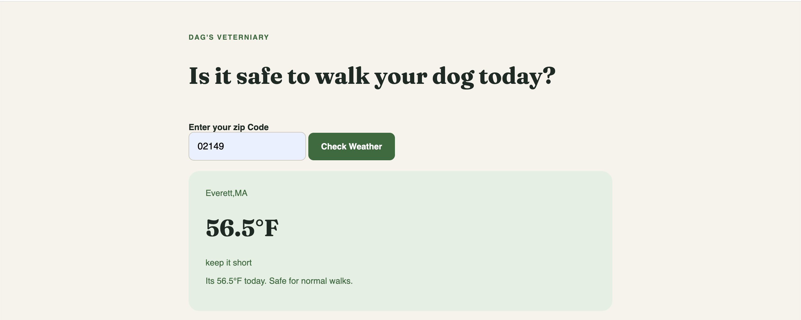

# Veterinary Practice API App

A simple front-end application that pulls data from one API and uses it to trigger a second API request to create something useful for a veterinary practice.

## Demo



## Overview

This project is designed to simulate a real-world workflow in a veterinary setting:

- Fetch ZIPCODE from the first api to extract the latitude and longitude  
- Use those data as query param to second api 


This is useful because it shows how data from different systems can be combined into a workflow that supports a veterinary practice.

## Tech Stack

This project is a lightweight front-end app using:

- HTML / CSS / JavaScript
- One API for reading data
- A second API for creating records or actions

## Getting Started

1. Clone the repository
2. Open the project in your code editor
3. Start the app locally

Example:

```bash
npm install
npm run dev
```

If your project uses a different setup, follow the commands in your package configuration instead.

## How It Works

The app follows a simple API flow:

```text
Fetch data from API 1
  -> display or prepare the result
  -> send relevant information to API 2
  -> create a veterinary-related record or action
```

This pattern is common in real systems where one service provides information and another service performs an operation.

## Project Goal

The main objective is to build a practical front-end app that connects multiple APIs to create a meaningful veterinary workflow. The result should be clean, functional, and easy for a user to operate.

## License

This project is for learning and demonstration purposes.

